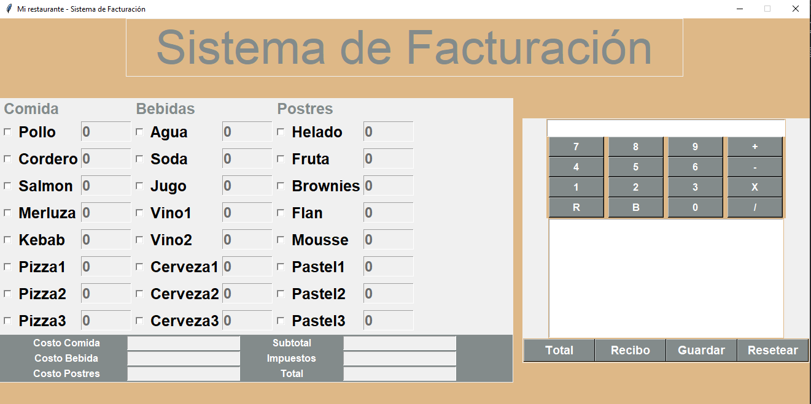

# Sistema de Facturación para Restaurante

Este es un sistema de facturación para restaurantes desarrollado en Python utilizando la biblioteca Tkinter para la interfaz gráfica. Permite gestionar pedidos, calcular costos, generar recibos y guardarlos como archivos de texto.

## Características

- Selección de comidas, bebidas y postres.
- Cálculo automático de costos e impuestos.
- Generación de recibos detallados.
- Posibilidad de guardar los recibos en archivos de texto.
- Interfaz gráfica intuitiva con botones de control.

## Requisitos

Este proyecto utiliza:

- Python 3.x
- Tkinter (incluido en Python por defecto)

## Capturas de Pantalla

